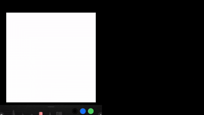

<div align="center">
<h1 style="border-bottom: none; margin-bottom: 0px">Topology-Preserving Sketch-Based Generation of 3D Assets</h1>

[**Selin Akmen**](https://www.linkedin.com/in/selin-akmen-7a825b24a/) · [**Namozjon Ostonaev**](https://www.linkedin.com/in/namoz-ostonaev/)

<a href="docs/paper.pdf"></a>
<a href='docs/poster.pdf'></a>

</div>

<br>
<p align="center">
  
</p>

## Motivation

Current 3D generation approaches often struggle to balance diversity with structural consistency. Existing models either lack diversity when the topology is well-preserved, or they lose topological stability over multiple iterations when diversity is high.

This limitation motivates our primary research question:

> _"Can we generate highly diverse and high-fidelity meshes through diffusion models, and edit parts while preserving the topology of the unedited part?"_

To address this, we leverage existing diffusion-based generation models (FLUX.2 and TRELLIS) to achieve high diversity and propose a novel **attention-caching and masking mechanism** (KV-Cache Engine and Automatic Bounding Box extraction) for the latent space to ensure topological stability during local sketch-based edits.

## Qualitative Results

Our method is capable of generating meshes that closely resemble ground-truth shapes. It accurately interprets user edits in specific regions (such as replacements or removals) while preserving the unedited parts of the original geometry.

<p align="center">
  
</p>

---

## Setup & Installation

Clone the repository

```bash
git clone --recurse-submodules https://github.com/Namozbey/t-pres.git
cd t-pres
```

Due to the complex interactions between 3D generation (Trellis), Image Generation (Flux.2), and Depth Estimation (Depth Anything 3), strict environment management is required to prevent CUDA and PyTorch conflicts.

**1. Create the environment:**

```bash
conda create -n t_pres python=3.11
conda activate t_pres
```

**2. Install PyTorch & Core Attention (Xformers):**

```bash
pip install torch==2.4.0 torchvision==0.19.0 torchaudio==2.4.0 --index-url https://download.pytorch.org/whl/cu118
pip install xformers==0.0.27.post2 --index-url https://download.pytorch.org/whl/cu118
```

**3. Install Project Dependencies:**

```bash
pip install -r requirements.txt
```

**4. Install 3D Rendering Libraries:**

```bash
pip install kaolin==0.18.0 -f https://nvidia-kaolin.s3.us-east-2.amazonaws.com/torch-2.4.0_cu118.html
```

_(Windows Users: Building `nvdiffrast` requires Visual Studio C++ Build Tools. To avoid `Ninja` parallel-build crashes and `NumPy` build errors, run these exact commands in your active Command Prompt to safely compile it):_

```cmd
call "C:\Program Files (x86)\Microsoft Visual Studio\2022\BuildTools\VC\Auxiliary\Build\vcvars64.bat" -vcvars_ver=14.29
set DISTUTILS_USE_SDK=1
set USE_NINJA=0

pip install git+https://github.com/NVlabs/nvdiffrast.git --no-build-isolation
pip install "git+https://github.com/autonomousvision/mip-splatting.git#subdirectory=submodules/diff-gaussian-rasterization" --no-build-isolation
pip install git+https://github.com/nerfstudio-project/gsplat.git@0b4dddf04cb687367602c01196913cde6a743d70 --no-build-isolation
```

_(If you are using VS Community instead of BuildTools, adjust the path to `\2022\Community\...`)_

**5. Install Depth Anything V3:**

```bash
cd Depth-Anything-V3
pip install -e . --no-deps
cd ..
```

## Usage

The pipeline is stateful and automatically saves intermediate outputs, generated meshes, and model states in the `state/` directory. By default, consecutive runs will attempt to use this cache to edit the previous generation.

### 1. Initial Generation

To generate a 3D mesh from a sketch for the first time, simply provide the path to your sketch:

```bash
python sketch2mesh.py -s samples/truck_1.png
```

### 2. Editing the Generation

To edit the previously generated mesh, run the script again with the edited sketch. The pipeline will automatically detect the previous state in the `state/` folder, calculate the differences, and apply a localized edit:

```bash
python sketch2mesh.py -s samples/truck_2.png
```

### 3. Starting a New Generation

If you want to start a completely new generation (clearing the previous cache), use the `--not-from-cache` or `-nc` flag:

```bash
python sketch2mesh.py -s samples/bottle_1.png -nc
```

Once the initial generation is complete, you can edit this new object normally without the flag:

```bash
python sketch2mesh.py -s samples/bottle_2.png
```

### 🐛 Debugging & Visualization

If you need to verify the spatial math and want to see the 3D bounding box coverage of the edited region:

1. Open `sketch2mesh.py`.
2. Uncomment the imports on **lines 56 and 62**.
3. Uncomment the function calls `sample_mesh_surface(prev_mesh)` and `visualize_bounding_box(...)` on **lines 181 and 182**.

This will pop up a 3D visualizer showing the mesh and the calculated bounding box area before the edit is applied.
